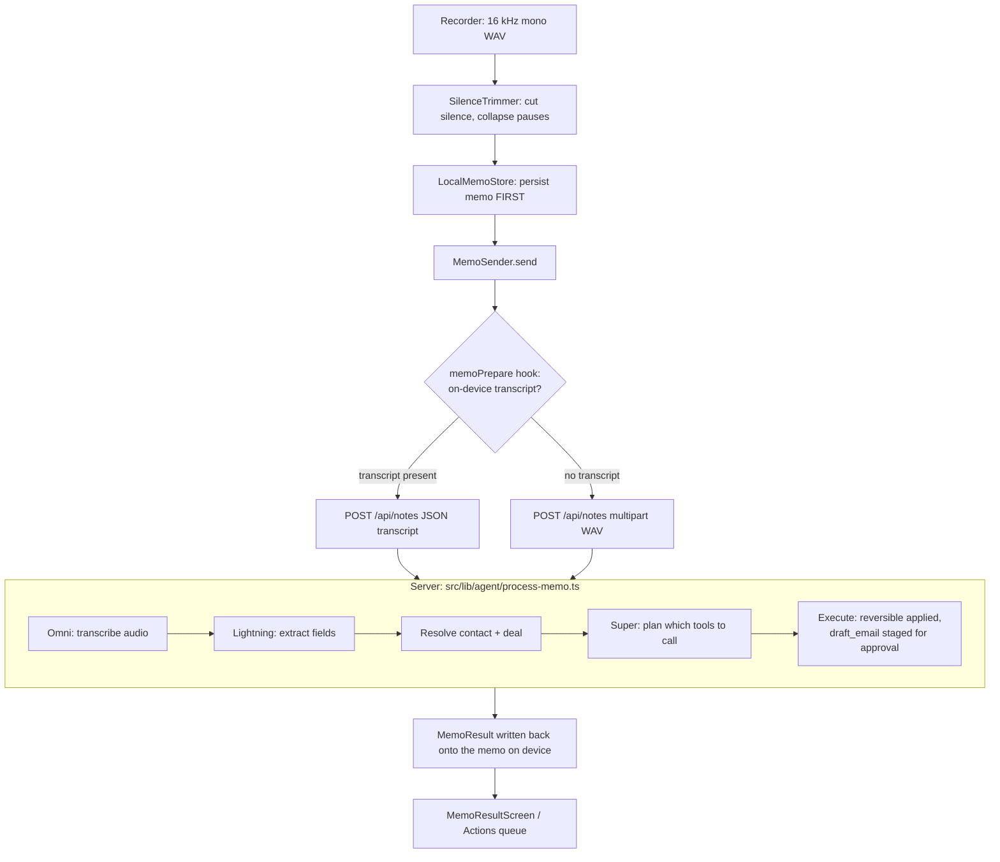

# Mobile architecture

The Flutter app in `mobile/` is a thin client over the Ringly Next.js API. It
holds no secrets and runs no model — it records audio, keeps memos safe on
disk, talks to the API, and renders what the agent did. All reasoning happens
server-side on Nebius.

## Layers

```
lib/
  core/        Cross-cutting plumbing: HTTP, errors, audio, env, theme.
  data/        Models (mirror the server's JSON), repositories (one per
               endpoint), and the local-first memo store.
  providers/   Riverpod wiring — the seams where core/data meet the UI.
  features/    Screens and widgets, grouped by product area.
```

Rule of thumb: `features/` depends on `providers/`, `providers/` wires up
`data/` and `core/`, and nothing in `core/` or `data/` imports a widget.

## The `lib/` tree

Files marked *(planned/merging)* are specified in tasks 7–14 and land from
parallel agent branches; read the worktree for their current state.

```
lib/
  app.dart                         Root widget + go_router route table.
  main_dev.dart                    Entrypoint → emulator host (10.0.2.2:3000).
  main_prod.dart                   Entrypoint → deployed API.

  core/
    env.dart                       Base-URL constants (emulator / production).
    api_client.dart                The one shared Dio instance + error interceptor.
    api_call.dart                  Wrap a Dio call so UI only sees typed errors.
    errors.dart                    Exception hierarchy mirroring the server's error bodies.
    error_message.dart             friendlyError() — one plain sentence per error.
    format.dart                    Small display helpers (dates, durations).
    audio/
      wav.dart                     Parse/encode 16-bit PCM WAV.
      silence_trimmer.dart         Energy-based VAD trimming, no model.
    theme/
      app_theme.dart               Material theme.
      app_colors.dart              Palette.

  data/
    json.dart                      Safe JSON readers (readString/readInt/readDate…).
    models/
      health.dart                  /api/health flags.
      today.dart                   /api/today snapshot (reminders, events, drafts).
      deal.dart                    Board + deal, with drift signals.
      briefing.dart                Morning briefing.
      usage.dart                   Nemotron tier usage.
      memo_result.dart             The full /api/notes response.
    repositories/
      health_repository.dart       GET /api/health
      today_repository.dart        GET /api/today
      deals_repository.dart        GET /api/deals, PATCH /api/deals/[id]
      briefing_repository.dart     GET /api/briefing
      usage_repository.dart        GET /api/usage
      notes_repository.dart        POST /api/notes (audio multipart OR transcript JSON)
      drafts_repository.dart       POST /api/drafts/[id] (approve / discard)
      reminders_repository.dart    PATCH /api/reminders/[id] (done/dismissed/pending)
    memo/
      local_memo.dart              A memo as persisted on disk + its status.
      local_memo_store.dart        One <id>.json + <id>.wav per memo; atomic writes.

  providers/
    api_providers.dart             baseUrlProvider, apiClientProvider, every repo provider.
    data_providers.dart            FutureProviders for health/today/board/usage/briefing.
    memo_providers.dart            clock, memo store, audio capture, mic permission,
                                    silence trimmer, memos list.
    transcription_providers.dart   memoPrepareProvider — the on-device transcription hook.
    pending_actions_provider.dart  Count for the Actions tab badge.

  features/
    auth/
      screens/login_screen.dart    Demo login (test123@gmail.com / test123).
      screens/signup_screen.dart
      widgets/…                    primary_button, app_text_field.
    home/
      home_screen.dart             The prioritised home feed.
      widgets/…                    briefing_card, needs_you_card, todays_calls_section,
                                    pipeline_pulse_section, ai_activity_section,
                                    integrations_section, quick_record_card, home_section.
    recorder/
      recorder_screen.dart         Record UI.
      recorder_controller.dart     Record state machine (idle→recording→saved).
      audio_capture.dart           Mic interface + 16 kHz mono WAV impl + permission.
      widgets/…                    waveform, text_note_sheet, recent_memos_list.
    memo/
      memo_sender.dart             Send one memo; write the outcome back to disk.
      submission_controller.dart   Submit + invalidate affected providers.
      memo_result_screen.dart      "What happened" screen with undo.
      widgets/action_tile.dart     One executed action row.
    shared/
      widgets/app_shell.dart       Tab scaffold + drawer + badge.
      widgets/ringly_bottom_bar.dart   Five-tab bar with raised Record.
      widgets/nav_destinations.dart    The five destinations, as data.
      widgets/circular_menu_button.dart
      widgets/app_drawer.dart
      widgets/placeholder_page.dart

  # planned/merging (tasks 7–14):
  #   data/outbox/…                 Offline outbox + exponential backoff.
  #   features/actions/…            Approval queue + mailto handoff.
  #   features/settings/…           Grouped settings screen.
  #   features/models/…             Live Nemotron tier table.
  #   features/pipeline/…           Kanban board.
  #   features/deal/…               Deal detail + pre-call brief.
  #   data/repositories/models_repository.dart  GET /api/models/whisper.
  #   core/transcription/…          Engine interface, UnavailableEngine, download manager.
  #   core/contacts/…               Dart port of contact-matching.ts.
```

## State management (Riverpod 3)

- **One HTTP client, injected once.** `apiClientProvider` watches
  `baseUrlProvider`; every repository provider watches `apiClientProvider`. No
  repository ever hardcodes a URL.
- **The base URL is overridden per entrypoint.** `main_dev.dart` overrides
  `baseUrlProvider` with `Env.emulatorBaseUrl` (`http://10.0.2.2:3000`, the
  emulator's alias for the host); `main_prod.dart` overrides it with
  `Env.productionBaseUrl`. The `RinglyApp` widget itself has no opinion on the
  backend.
- **Auto-retry is disabled.** Both entrypoints pass `retry: (_, __) => null` to
  `ProviderScope`, so a "not configured" or offline error surfaces immediately
  and pull-to-refresh is the user's explicit retry.
- **Data reads are `FutureProvider`s** (`healthProvider`, `todayProvider`,
  `boardProvider`, `usageProvider`, `briefingProvider`); they are invalidated
  after any write that could change them (e.g. after a memo syncs, the
  submission controller invalidates today/board/usage).
- **Injectable seams for tests:** `clockProvider` (now), `audioCaptureProvider`,
  `micPermissionProvider`, `silenceTrimmerProvider`, `memoStoreProvider`.

## Routing (go_router)

`createRouter()` is a factory (not a global) so widget tests can start on any
route without walking through login.

| Path | Name | Screen | In `AppShell`? |
|---|---|---|---|
| `/login` | `login` | `LoginScreen` | full-screen |
| `/signup` | `signup` | `SignupScreen` | full-screen |
| `/dashboard` | `dashboard` | redirect → `/home` | — |
| `/home` | `home` | `HomeScreen` | yes |
| `/pipeline` | `pipeline` | Pipeline (placeholder → merging) | yes |
| `/recorder` | `recorder` | `RecorderScreen` | yes |
| `/actions` | `actions` | Actions (placeholder → merging) | yes |
| `/models` | `models` | Models (placeholder → merging) | yes |
| `/memo/:id` | `memo-result` | `MemoResultScreen` | full-screen |
| `/deal/:id` | `deal-detail` | Deal detail (placeholder → merging) | full-screen |
| `/settings` | `settings` | Settings (placeholder → merging) | full-screen |

## The memo pipeline

Every recording is persisted to disk *before* any network call, so nothing is
lost to a crash or a dead zone. On-device transcription, when enabled, plugs in
at the `memoPrepare` hook so only text leaves the phone; by default the audio
is uploaded and Nemotron Omni transcribes it on Nebius.



(The audio path runs Omni first; the text path skips straight to Lightning.)

## Error handling

- The server returns `{ error, code, hint }` on failure (see `src/lib/api.ts`).
- `ApiClient`'s interceptor turns that body into a typed exception
  (`NebiusNotConfiguredException`, `DatabaseNotConfiguredException`,
  `TranscriptionUnavailableException`, `DealNotFoundException`,
  `BadModelOutputException`, `ModelCallFailedException`) or, when there's no
  response at all, a `NetworkException`.
- `apiCall()` wraps every repository call so UI code only ever catches those
  types, never a raw `DioException`.
- `friendlyError()` maps any error to one plain sentence; "not configured"
  errors are phrased as calm setup instructions, and `isNotConfigured()` lets
  the UI render them as a notice rather than a red error.

## Testing approach

- **`FakeAdapter`** — a Dio adapter that answers from a `"METHOD /path"` route
  table instead of the network, records every request, and can throw to
  simulate offline. `fakeClient()` wires it into a real `ApiClient` so the
  interceptor and typed-error mapping are exercised for real.
- **Fakes for hardware seams** — `recorder_fakes.dart` fakes audio capture,
  mic permission and the clock, so the recorder state machine is tested with no
  device.
- **Temp dirs** — `LocalMemoStore` tests run against a real temp directory, so
  the atomic write/rename and read-back are exercised end to end.
- **`audio_fixtures.dart`** — canned WAV bytes for the trimmer and WAV parser
  tests.

## API contract

Everything the app calls. Base URL is per-entrypoint; error bodies are
`{ error, code, hint }`.

| Method | Path | Request | Response |
|---|---|---|---|
| GET | `/api/health` | — | `{ ok, nebius, database, tavily }` booleans |
| GET | `/api/today` | — | `{ reminders, events, drafts, now }` |
| GET | `/api/deals` | — | Board: deals grouped by stage with drift signals |
| PATCH | `/api/deals/[id]` | `{ stage? , title?, nextAction?, budget? }` | `{ ok, id, ... }`; a stage change is logged as a manual action |
| GET | `/api/deals/[id]` | — | Deal detail + timeline |
| GET | `/api/deals/[id]/brief` | — | Pre-call brief (never cached, Nemotron Super) |
| GET | `/api/briefing` | `?force=1` bypasses daily cache | Morning briefing (Nemotron Ultra) |
| GET | `/api/usage` | — | `{ tiers[], recent[], actionCounts[], totals }` |
| POST | `/api/notes` | multipart `audio` (WAV) + `durationSeconds`, **or** JSON `{ transcript }` | `MemoResult`: `{ noteId, transcript, extraction, target, report.actions[], traces, noActionReason, transcriptionProvider }` |
| POST | `/api/drafts/[id]` | `{ action: "approve"\|"discard", subject?, body? }` | `{ ok, id, status }` |
| PATCH | `/api/reminders/[id]` | `{ status: "done"\|"dismissed"\|"pending" }` | `{ ok, id, status }` |
| GET | `/api/events/[id]/ics` | — | `text/calendar` `.ics` attachment |
| GET | `/api/models/whisper` *(merging)* | — | Manifest of ggml files with SHA-256 hashes |

Notes on `/api/notes`: the audio path is transcribed by Nemotron Omni
server-side; the transcript path (typed note **or** on-device transcription) is
a first-class way in, not a fallback — it keeps the full agent loop
demonstrable without a microphone or a transcription provider. Audio is capped
at 10 MB; transcripts at 20,000 chars.
